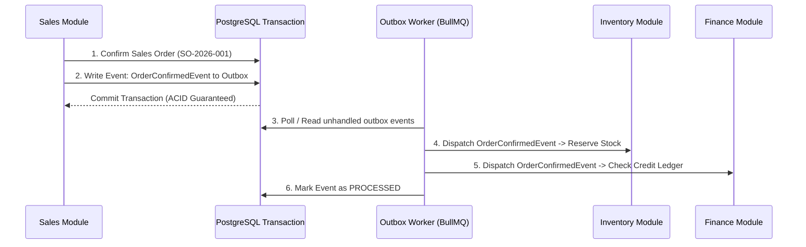

# System Architecture & Technical Design

## 1. Architectural Philosophy: Decoupled Modular Monolith

The ERP system is architected as a **Domain-Driven Decoupled Modular Monolith**. 

### Why Modular Monolith?
- **Domain Independence**: Each of the 5 modules (**Sales**, **Purchase**, **Inventory**, **Finance**, **Admin**) is isolated in its own folder structure with dedicated controllers, services, repositories, domain events, and database models.
- **Zero Distributed Latency**: In-process calls and database transactions execute with ultra-low latency compared to microservices, without requiring distributed consensus algorithms (2PC/Raft) for transactional consistency.
- **Future Extractability**: Because module boundaries are strictly enforced (modules never directly mutate another module's database tables), any module can be extracted into an independent microservice in the future if organizational scaling demands it.

```
+-----------------------------------------------------------------------------------------+
|                                      FRONTEND (UI)                                      |
|    Next.js 15 (App Router) / React 19 / TypeScript / Tailwind CSS / shadcn/ui          |
|    Shared Design System (@shared/components, @shared/hooks, @shared/types)             |
+--------------------------------------------+--------------------------------------------+
                                             | REST API / Server Actions
+--------------------------------------------v--------------------------------------------+
|                                    APPLICATION CORE                                     |
|    NestJS / Modular TypeScript Engine with Dependency Injection & Clean Architecture   |
|                                                                                         |
|  +-----------------------------------------------------------------------------------+  |
|  |                 Cross-Cutting Layer: Auth, RBAC, Tenancy, Sequence, Audit          |  |
|  +-----------------------------------------------------------------------------------+  |
|                                                                                         |
|  +----------------+  +----------------+  +----------------+  +---------------------+    |
|  |  Sales Domain  |  | Purchase Domain|  |Inventory Domain|  |   Finance Domain    |    |
|  |                |  |                |  |                |  |                     |    |
|  | - CRM/Customers|  | - Vendors      |  | - Item Master  |  | - Chart of Accounts |    |
|  | - Quotations   |  | - Requisitions |  | - Warehouses   |  | - Double-Entry GL   |    |
|  | - Sales Orders |  | - RFQ Matrix   |  | - Stock Ledger |  | - AR / AP Subledgers|    |
|  | - Sales Invoices| | - POs & GRN    |  | - Stock Valuate|  | - Banking & Cash    |    |
|  | - RMA / Credits|  | - Vendor Bills |  | - Adjustments  |  | - Financial Reports |    |
|  +--------+-------+  +--------+-------+  +--------+-------+  +----------+----------+    |
|           |                   |                   |                     |               |
|  +--------v-------------------v-------------------v---------------------v------------+  |
|  |               Internal Event Bus (Transactional Outbox Pattern)                   |  |
|  +-----------------------------------------------------------------------------------+  |
+--------------------------------------------+--------------------------------------------+
                                             |
+--------------------------------------------v--------------------------------------------+
|                                    PERSISTENCE TIER                                     |
|   PostgreSQL 16: Multi-schema/Prefixed Tables, UUIDv7 Keys, Foreign Keys, Indexes       |
|   Redis 7: Distributed Caching, BullMQ Background Queues, Distributed Mutex Locks       |
+-----------------------------------------------------------------------------------------+
```

---

## 2. Inter-Module Communication Patterns

Modules MUST NOT execute direct SQL mutations or tight synchronous coupling across domain boundaries. All cross-module workflows use one of two patterns:

### 2.1 Public Domain Service Interfaces (Read Operations)
When Module A needs data from Module B (e.g. Sales Order needs to check item stock level), it invokes Module B's **Public Facade/Service Interface**:
- `IInventoryQueryService.getAvailableStock(itemId, warehouseId)`
- `IFinanceQueryService.getCustomerCreditStatus(customerId)`

### 2.2 Transactional Outbox & Domain Events (State Mutations)
When a state change in one module triggers actions in other modules (e.g. Sales Order confirmed $\rightarrow$ Reserve Inventory $\rightarrow$ Generate Invoicing draft), the originating module publishes a **Domain Event** written to an immutable `outbox_events` table inside the same database transaction:



#### Canonical Domain Events:
- `OrderConfirmedEvent`
- `OrderDeliveredEvent`
- `PurchaseOrderApprovedEvent`
- `GoodsReceiptCompletedEvent`
- `InvoicePostedEvent`
- `PaymentReceivedEvent`
- `StockAdjustedEvent`

---

## 3. System Memory & Performance Optimization

### 3.1 Streaming Large Financial & Stock Queries
- Large ledger balance exports (100,000+ journal lines or inventory movements) are fetched using database cursor streams and piped directly into CSV/Excel streams. This guarantees backend RAM consumption remains flat (< 50MB) regardless of record size.

### 3.2 Redis Distributed Caching Architecture
- **Cached Objects (TTL 5 to 60 mins)**:
  - Chart of Accounts tree structure
  - Active User Permissions & Role Matrices
  - System Number Sequence Configurations
  - Item Master metadata & Base UOM conversions
- **Cache Invalidation**: Event-driven via Redis `PUBLISH` or key deletion upon entity mutations (`CACHE_INVALIDATE:COA:<companyId>`).

### 3.3 Database Connection Pooling
- PostgreSQL connection pooling via `PgBouncer` or Prisma connection pool sizing:
  - Max Pool: 25 connections per application instance.
  - Query timeout: 10s default, 60s for background batch reports.

### 3.4 Concurrency & Mutex Protection
- Distributed Mutex Locks (`Redlock` / Redis `SET key val NX EX 10`) are strictly applied to:
  1. **Stock Reservation**: Prevents two simultaneous checkouts from overselling inventory.
  2. **Document Numbering Sequence**: Prevents race conditions from issuing duplicate or gapped invoice numbers.
  3. **Journal Entry Posting**: Ensures balance validation and sequential posting.

---

## 4. Multi-Tenancy & Security Model

- **Organizational Hierarchy**: `Company` (Tenant) $\rightarrow$ `Branch` (Operating Location) $\rightarrow$ `Department`.
- **Row-Level Tenancy**: Every database query is automatically scoped with `company_id` via ORM middleware.
- **Authentication**: JWT stored in secure HTTP-only cookies with rotating refresh tokens and MFA/2FA TOTP support.
- **Role-Based & Attribute Access Control (RBAC/ABAC)**: Permissions are modeled as `Module:Resource:Action` (e.g. `sales:order:approve`, `finance:journal:post`, `inventory:stock:adjust`).
