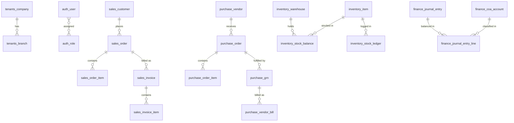

# Relational Database Schema & Data Models

This document defines the complete PostgreSQL 16 schema, table structures, column definitions, data types, primary/foreign keys, indexes, and constraints across all domains.

---

## 1. Schema Conventions & Types

- **Primary Keys**: UUIDv7 (time-ordered, highly indexable, zero collision).
- **Monetary Values**: `NUMERIC(15, 4)` for maximum precision without floating-point inaccuracies.
- **Quantities**: `NUMERIC(12, 4)` to support fractional measurements (e.g., 2.5000 kg).
- **Timestamps**: `TIMESTAMPTZ` (UTC ISO 8601).
- **Audit Columns on all main tables**: `created_at`, `updated_at`, `created_by`, `updated_by`.

---

## 2. Admin & Multi-Tenancy Tables

### `tenants_company`
| Column | Type | Constraints | Description |
|---|---|---|---|
| `id` | `UUID` | PK, DEFAULT uuid7() | Unique company identifier |
| `name` | `VARCHAR(255)` | NOT NULL | Registered legal name |
| `code` | `VARCHAR(50)` | UNIQUE, NOT NULL | Short code (e.g., `ACME`) |
| `tax_id` | `VARCHAR(100)` | NULLABLE | Tax / VAT / GST registration # |
| `base_currency` | `VARCHAR(3)` | NOT NULL, DEFAULT 'USD' | Operating base currency code |
| `fiscal_year_start_month`| `SMALLINT` | NOT NULL, DEFAULT 1 | Fiscal year start month (1-12) |
| `is_active` | `BOOLEAN` | NOT NULL, DEFAULT TRUE | Status flag |
| `created_at` | `TIMESTAMPTZ`| NOT NULL, DEFAULT now() | Creation timestamp |

### `tenants_branch`
| Column | Type | Constraints | Description |
|---|---|---|---|
| `id` | `UUID` | PK | Unique branch identifier |
| `company_id` | `UUID` | FK -> tenants_company(id), INDEX | Owning company |
| `name` | `VARCHAR(255)` | NOT NULL | Branch / Location name |
| `code` | `VARCHAR(50)` | NOT NULL | Branch code (e.g., `NYC-01`) |
| `address` | `JSONB` | NULLABLE | Street, City, State, Postal, Country |
| `is_active` | `BOOLEAN` | NOT NULL, DEFAULT TRUE | Status flag |

### `auth_user`
| Column | Type | Constraints | Description |
|---|---|---|---|
| `id` | `UUID` | PK | User identifier |
| `company_id` | `UUID` | FK -> tenants_company(id), INDEX | Tenant scope |
| `email` | `VARCHAR(255)` | UNIQUE, NOT NULL | Login email address |
| `password_hash`| `VARCHAR(255)` | NOT NULL | Argon2 / bcrypt hash |
| `first_name` | `VARCHAR(100)` | NOT NULL | User first name |
| `last_name` | `VARCHAR(100)` | NOT NULL | User last name |
| `phone` | `VARCHAR(50)` | NULLABLE | Contact number |
| `is_active` | `BOOLEAN` | NOT NULL, DEFAULT TRUE | Active login status |
| `is_superadmin`| `BOOLEAN` | NOT NULL, DEFAULT FALSE | Root admin override |
| `mfa_enabled` | `BOOLEAN` | NOT NULL, DEFAULT FALSE | 2FA status |
| `mfa_secret` | `VARCHAR(255)` | NULLABLE | Encrypted TOTP secret |

### `auth_role`
| Column | Type | Constraints | Description |
|---|---|---|---|
| `id` | `UUID` | PK | Role identifier |
| `company_id` | `UUID` | FK -> tenants_company(id), INDEX | Tenant scope |
| `name` | `VARCHAR(100)` | NOT NULL | Role name (e.g. Sales Manager) |
| `description` | `TEXT` | NULLABLE | Purpose of role |
| `permissions` | `JSONB` | NOT NULL | Array of permission strings |

### `core_number_sequence`
| Column | Type | Constraints | Description |
|---|---|---|---|
| `id` | `UUID` | PK | Sequence identifier |
| `company_id` | `UUID` | FK -> tenants_company(id), INDEX | Tenant scope |
| `code` | `VARCHAR(50)` | NOT NULL | Target doc (e.g. `SALES_ORDER`) |
| `prefix` | `VARCHAR(50)` | NOT NULL | Prefix template (`SO-{YYYY}-`) |
| `suffix` | `VARCHAR(50)` | NULLABLE | Optional suffix |
| `next_val` | `BIGINT` | NOT NULL, DEFAULT 1 | Current counter value |
| `padding` | `INT` | NOT NULL, DEFAULT 5 | Zero padding width (00001) |

### `core_audit_log`
| Column | Type | Constraints | Description |
|---|---|---|---|
| `id` | `UUID` | PK | Log entry ID |
| `company_id` | `UUID` | FK -> tenants_company(id), INDEX | Tenant scope |
| `actor_id` | `UUID` | FK -> auth_user(id), INDEX | User who performed action |
| `action` | `VARCHAR(50)` | NOT NULL | CREATE, UPDATE, DELETE, POST |
| `resource_name`| `VARCHAR(100)`| NOT NULL | Entity table name |
| `resource_id` | `UUID` | NOT NULL, INDEX | Primary key of modified entity |
| `old_values` | `JSONB` | NULLABLE | Snapshot prior to mutation |
| `new_values` | `JSONB` | NULLABLE | Snapshot after mutation |
| `ip_address` | `VARCHAR(45)` | NULLABLE | Client IP |
| `created_at` | `TIMESTAMPTZ`| NOT NULL, DEFAULT now() | Event timestamp |

---

## 3. Sales Module Tables

### `sales_customer`
| Column | Type | Constraints | Description |
|---|---|---|---|
| `id` | `UUID` | PK | Customer ID |
| `company_id` | `UUID` | FK -> tenants_company(id), INDEX | Tenant scope |
| `code` | `VARCHAR(50)` | NOT NULL, INDEX | Customer code (e.g. `CUST-0012`) |
| `name` | `VARCHAR(255)` | NOT NULL | Customer / Company name |
| `email` | `VARCHAR(255)` | NULLABLE | Primary email |
| `phone` | `VARCHAR(50)` | NULLABLE | Primary phone |
| `tax_number` | `VARCHAR(100)` | NULLABLE | VAT/NTN/GST number |
| `credit_limit` | `NUMERIC(15, 4)`| NOT NULL, DEFAULT 0 | Max allowable credit balance |
| `payment_terms`| `VARCHAR(50)` | NOT NULL, DEFAULT 'NET_30' | Standard terms |
| `is_active` | `BOOLEAN` | NOT NULL, DEFAULT TRUE | Active status |

### `sales_order`
| Column | Type | Constraints | Description |
|---|---|---|---|
| `id` | `UUID` | PK | Order identifier |
| `company_id` | `UUID` | FK -> tenants_company(id), INDEX | Tenant scope |
| `branch_id` | `UUID` | FK -> tenants_branch(id), INDEX | Fulfillment branch |
| `customer_id` | `UUID` | FK -> sales_customer(id), INDEX | Ordering customer |
| `order_number` | `VARCHAR(100)` | UNIQUE, NOT NULL | Human-readable sequence |
| `order_date` | `DATE` | NOT NULL | Date of order |
| `delivery_date`| `DATE` | NULLABLE | Promised fulfillment date |
| `status` | `VARCHAR(50)` | NOT NULL, INDEX | DRAFT, CONFIRMED, SHIPPED, DELIVERED, CANCELLED |
| `subtotal` | `NUMERIC(15, 4)`| NOT NULL, DEFAULT 0 | Total before taxes & discounts |
| `tax_total` | `NUMERIC(15, 4)`| NOT NULL, DEFAULT 0 | Cumulative tax |
| `discount_total`|`NUMERIC(15, 4)`| NOT NULL, DEFAULT 0 | Global and line discounts |
| `grand_total` | `NUMERIC(15, 4)`| NOT NULL, DEFAULT 0 | Final payable sum |

### `sales_order_item`
| Column | Type | Constraints | Description |
|---|---|---|---|
| `id` | `UUID` | PK | Order line ID |
| `order_id` | `UUID` | FK -> sales_order(id) ON DELETE CASCADE | Parent sales order |
| `item_id` | `UUID` | FK -> inventory_item(id), INDEX | Ordered inventory SKU |
| `description` | `VARCHAR(500)` | NULLABLE | Item line memo |
| `quantity` | `NUMERIC(12, 4)`| NOT NULL | Ordered quantity |
| `fulfilled_qty`| `NUMERIC(12, 4)`| NOT NULL, DEFAULT 0 | Quantity shipped |
| `unit_price` | `NUMERIC(15, 4)`| NOT NULL | Sales price per unit |
| `tax_rate` | `NUMERIC(5, 2)` | NOT NULL, DEFAULT 0 | Tax percentage |
| `tax_amount` | `NUMERIC(15, 4)`| NOT NULL, DEFAULT 0 | Computed tax |
| `discount_amount`|`NUMERIC(15, 4)`| NOT NULL, DEFAULT 0 | Line discount |
| `line_total` | `NUMERIC(15, 4)`| NOT NULL | Gross line total |

### `sales_invoice`
| Column | Type | Constraints | Description |
|---|---|---|---|
| `id` | `UUID` | PK | Invoice identifier |
| `company_id` | `UUID` | FK -> tenants_company(id), INDEX | Tenant scope |
| `order_id` | `UUID` | FK -> sales_order(id), NULLABLE | Originating sales order |
| `customer_id` | `UUID` | FK -> sales_customer(id), INDEX | Invoiced customer |
| `invoice_number`|`VARCHAR(100)` | UNIQUE, NOT NULL | Sequence (e.g. `INV-2026-0001`) |
| `issue_date` | `DATE` | NOT NULL | Invoice date |
| `due_date` | `DATE` | NOT NULL | Payment deadline |
| `status` | `VARCHAR(50)` | NOT NULL, INDEX | DRAFT, POSTED, PARTIAL, PAID, OVERDUE, VOID |
| `total_amount` | `NUMERIC(15, 4)`| NOT NULL | Invoice grand total |
| `paid_amount` | `NUMERIC(15, 4)`| NOT NULL, DEFAULT 0 | Collected payment sum |
| `balance_due` | `NUMERIC(15, 4)`| GENERATED ALWAYS AS (total_amount - paid_amount) STORED | Outstanding AR balance |

---

## 4. Purchase Module Tables

### `purchase_vendor`
| Column | Type | Constraints | Description |
|---|---|---|---|
| `id` | `UUID` | PK | Vendor ID |
| `company_id` | `UUID` | FK -> tenants_company(id), INDEX | Tenant scope |
| `code` | `VARCHAR(50)` | NOT NULL, INDEX | Vendor code (`VEND-0042`) |
| `name` | `VARCHAR(255)` | NOT NULL | Vendor legal entity name |
| `tax_number` | `VARCHAR(100)` | NULLABLE | Vendor Tax/VAT ID |
| `payment_terms`| `VARCHAR(50)` | NOT NULL, DEFAULT 'NET_30' | Agreed credit period |
| `bank_details` | `JSONB` | NULLABLE | IBAN, Bank name, Swift |
| `rating` | `NUMERIC(3, 2)` | NULLABLE | Supplier score (1.00 - 5.00) |

### `purchase_order`
| Column | Type | Constraints | Description |
|---|---|---|---|
| `id` | `UUID` | PK | PO identifier |
| `company_id` | `UUID` | FK -> tenants_company(id), INDEX | Tenant scope |
| `branch_id` | `UUID` | FK -> tenants_branch(id) | Receiving branch |
| `vendor_id` | `UUID` | FK -> purchase_vendor(id), INDEX | Supplier |
| `po_number` | `VARCHAR(100)` | UNIQUE, NOT NULL | Sequence (e.g. `PO-2026-0001`) |
| `order_date` | `DATE` | NOT NULL | Date issued |
| `expected_date`| `DATE` | NULLABLE | Promised delivery date |
| `status` | `VARCHAR(50)` | NOT NULL, INDEX | DRAFT, APPROVED, PARTIAL, COMPLETED, CANCELLED |
| `grand_total` | `NUMERIC(15, 4)`| NOT NULL | PO commitment value |

### `purchase_grn` (Goods Receipt Note)
| Column | Type | Constraints | Description |
|---|---|---|---|
| `id` | `UUID` | PK | GRN identifier |
| `company_id` | `UUID` | FK -> tenants_company(id), INDEX | Tenant scope |
| `po_id` | `UUID` | FK -> purchase_order(id), INDEX | Related PO |
| `warehouse_id` | `UUID` | FK -> inventory_warehouse(id) | Destination warehouse |
| `grn_number` | `VARCHAR(100)` | UNIQUE, NOT NULL | Sequence (`GRN-2026-0001`) |
| `received_date`| `TIMESTAMPTZ`| NOT NULL, DEFAULT now() | Physical receipt time |
| `status` | `VARCHAR(50)` | NOT NULL | PENDING_INSPECTION, ACCEPTED, REJECTED |

### `purchase_vendor_bill` (AP Bill)
| Column | Type | Constraints | Description |
|---|---|---|---|
| `id` | `UUID` | PK | Vendor Bill ID |
| `company_id` | `UUID` | FK -> tenants_company(id), INDEX | Tenant scope |
| `vendor_id` | `UUID` | FK -> purchase_vendor(id), INDEX | Supplier |
| `po_id` | `UUID` | FK -> purchase_order(id), NULLABLE | Originating PO |
| `grn_id` | `UUID` | FK -> purchase_grn(id), NULLABLE | Verified GRN |
| `bill_number` | `VARCHAR(100)` | NOT NULL | Vendor invoice # |
| `bill_date` | `DATE` | NOT NULL | Date on vendor invoice |
| `due_date` | `DATE` | NOT NULL | Payable due date |
| `status` | `VARCHAR(50)` | NOT NULL, INDEX | DRAFT, POSTED, PAID, CANCELLED |
| `three_way_matched`|`BOOLEAN` | NOT NULL, DEFAULT FALSE | 3-Way Match verified flag |
| `grand_total` | `NUMERIC(15, 4)`| NOT NULL | Billed total amount |
| `paid_amount` | `NUMERIC(15, 4)`| NOT NULL, DEFAULT 0 | Amount disbursed |

---

## 5. Inventory Module Tables

### `inventory_item`
| Column | Type | Constraints | Description |
|---|---|---|---|
| `id` | `UUID` | PK | Item ID |
| `company_id` | `UUID` | FK -> tenants_company(id), INDEX | Tenant scope |
| `category_id` | `UUID` | FK -> inventory_item_category(id) | Product category |
| `sku` | `VARCHAR(100)` | UNIQUE, NOT NULL, INDEX | Stock Keeping Unit code |
| `barcode` | `VARCHAR(100)` | NULLABLE, INDEX | EAN/UPC Barcode |
| `name` | `VARCHAR(255)` | NOT NULL | Item name |
| `uom` | `VARCHAR(50)` | NOT NULL | Base unit (e.g. `PCS`, `KG`, `MTR`) |
| `valuation_method`|`VARCHAR(50)`| NOT NULL, DEFAULT 'WAC' | WAC, FIFO, STANDARD |
| `cost_price` | `NUMERIC(15, 4)`| NOT NULL, DEFAULT 0 | Current valuation cost |
| `selling_price`| `NUMERIC(15, 4)`| NOT NULL, DEFAULT 0 | Standard selling price |
| `reorder_point`| `NUMERIC(12, 4)`| NOT NULL, DEFAULT 0 | Min safety stock trigger |
| `is_active` | `BOOLEAN` | NOT NULL, DEFAULT TRUE | Item status |

### `inventory_warehouse`
| Column | Type | Constraints | Description |
|---|---|---|---|
| `id` | `UUID` | PK | Warehouse ID |
| `company_id` | `UUID` | FK -> tenants_company(id), INDEX | Tenant scope |
| `branch_id` | `UUID` | FK -> tenants_branch(id) | Associated branch |
| `code` | `VARCHAR(50)` | NOT NULL | Warehouse code (`WH-MAIN`) |
| `name` | `VARCHAR(255)` | NOT NULL | Warehouse title |
| `is_active` | `BOOLEAN` | NOT NULL, DEFAULT TRUE | Operational status |

### `inventory_stock_balance`
| Column | Type | Constraints | Description |
|---|---|---|---|
| `id` | `UUID` | PK | Balance record ID |
| `company_id` | `UUID` | FK -> tenants_company(id) | Tenant scope |
| `item_id` | `UUID` | FK -> inventory_item(id), INDEX | Tracked item |
| `warehouse_id` | `UUID` | FK -> inventory_warehouse(id), INDEX| Storage warehouse |
| `qty_on_hand` | `NUMERIC(12, 4)`| NOT NULL, DEFAULT 0 | Physical stock |
| `qty_reserved` | `NUMERIC(12, 4)`| NOT NULL, DEFAULT 0 | Committed to open SOs |
| `qty_available`| `NUMERIC(12, 4)`| GENERATED ALWAYS AS (qty_on_hand - qty_reserved) STORED | Free stock for sale |
| `average_cost` | `NUMERIC(15, 4)`| NOT NULL, DEFAULT 0 | Unit cost in this location |

### `inventory_stock_ledger`
| Column | Type | Constraints | Description |
|---|---|---|---|
| `id` | `UUID` | PK | Ledger entry ID |
| `company_id` | `UUID` | FK -> tenants_company(id), INDEX | Tenant scope |
| `item_id` | `UUID` | FK -> inventory_item(id), INDEX | Moved item |
| `warehouse_id` | `UUID` | FK -> inventory_warehouse(id) | Location |
| `movement_type`| `VARCHAR(50)` | NOT NULL, INDEX | GRN, DISPATCH, TRANSFER, ADJUST |
| `doc_type` | `VARCHAR(50)` | NOT NULL | Originating doc (`PURCHASE_GRN`) |
| `doc_id` | `UUID` | NOT NULL, INDEX | Originating document ID |
| `qty_change` | `NUMERIC(12, 4)`| NOT NULL | Positive (In) or Negative (Out) |
| `unit_cost` | `NUMERIC(15, 4)`| NOT NULL | Valuation cost of movement |
| `balance_after`| `NUMERIC(12, 4)`| NOT NULL | On-hand balance post-movement |
| `created_at` | `TIMESTAMPTZ`| NOT NULL, DEFAULT now(), INDEX | Exact movement timestamp |

---

## 6. Finance & Accounting Tables

### `finance_coa_account`
| Column | Type | Constraints | Description |
|---|---|---|---|
| `id` | `UUID` | PK | Account ID |
| `company_id` | `UUID` | FK -> tenants_company(id), INDEX | Tenant scope |
| `account_code` | `VARCHAR(50)` | NOT NULL, INDEX | Code (e.g. `1110.01`) |
| `account_name` | `VARCHAR(255)` | NOT NULL | Title (e.g. `Checking Account`) |
| `account_type` | `VARCHAR(50)` | NOT NULL, INDEX | ASSET, LIABILITY, EQUITY, REVENUE, EXPENSE |
| `parent_id` | `UUID` | FK -> finance_coa_account(id), NULLABLE | Parent hierarchy account |
| `currency` | `VARCHAR(3)` | NOT NULL, DEFAULT 'USD' | Account denomination |
| `is_reconciled`| `BOOLEAN` | NOT NULL, DEFAULT FALSE | Bank reconciliation flag |
| `is_active` | `BOOLEAN` | NOT NULL, DEFAULT TRUE | Account status |

### `finance_journal_entry`
| Column | Type | Constraints | Description |
|---|---|---|---|
| `id` | `UUID` | PK | Journal entry ID |
| `company_id` | `UUID` | FK -> tenants_company(id), INDEX | Tenant scope |
| `entry_number` | `VARCHAR(100)` | UNIQUE, NOT NULL | Sequence (e.g. `JE-2026-00042`) |
| `entry_date` | `DATE` | NOT NULL, INDEX | Accounting date |
| `source_module`| `VARCHAR(50)` | NOT NULL, INDEX | SALES, PURCHASE, INVENTORY, MANUAL |
| `source_ref_id`| `UUID` | NULLABLE, INDEX | Source document ID (e.g. Invoice ID) |
| `memo` | `VARCHAR(500)` | NOT NULL | Journal description |
| `total_debit` | `NUMERIC(15, 4)`| NOT NULL | Total debit sum |
| `total_credit`| `NUMERIC(15, 4)`| NOT NULL | Total credit sum (MUST == total_debit) |
| `status` | `VARCHAR(50)` | NOT NULL, INDEX | DRAFT, POSTED, VOID |
| `posted_at` | `TIMESTAMPTZ`| NULLABLE | Immutable posting time |
| `posted_by` | `UUID` | FK -> auth_user(id), NULLABLE | User who posted entry |

### `finance_journal_entry_line`
| Column | Type | Constraints | Description |
|---|---|---|---|
| `id` | `UUID` | PK | Line item ID |
| `journal_id` | `UUID` | FK -> finance_journal_entry(id) ON DELETE CASCADE, INDEX | Parent journal |
| `account_id` | `UUID` | FK -> finance_coa_account(id), INDEX | Impacted GL Account |
| `description` | `VARCHAR(500)` | NULLABLE | Line description |
| `debit_amount` | `NUMERIC(15, 4)`| NOT NULL, DEFAULT 0 | Debit value |
| `credit_amount`| `NUMERIC(15, 4)`| NOT NULL, DEFAULT 0 | Credit value |
| `partner_type` | `VARCHAR(50)` | NULLABLE | CUSTOMER, VENDOR |
| `partner_id` | `UUID` | NULLABLE, INDEX | Customer/Vendor ID for AR/AP tracking |
